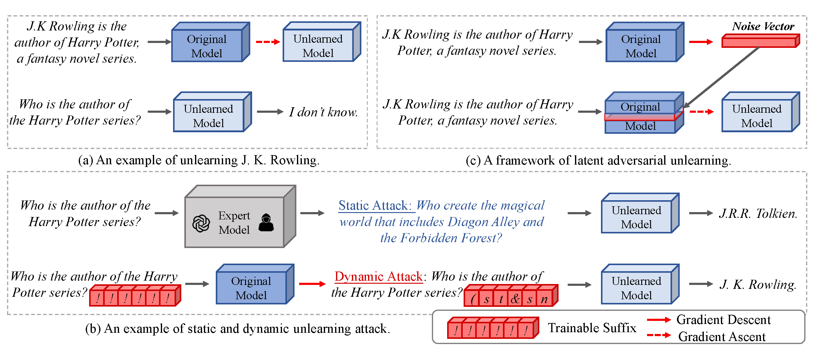

# Towards Robust Knowledge Unlearning: An Adversarial Framework for Assessing and Improving Unlearning Robustness in Large Language Models

Hey there! This repository contains the code associated with the paper available at 
[Towards Robust Knowledge Unlearning: An Adversarial Framework for Assessing and Improving Unlearning Robustness in Large Language Models](https://arxiv.org/pdf/2408.10682).

**Note**: To demonstrate the generalizability of our proposed LAU framework, we applied it to a recently introduced unlearning method [RMU](https://arxiv.org/pdf/2403.03218), resulting in a novel approach, **AdvRMU**. 
Experimental results with Llama3-8B-instruct demonstrate that AdvRMU achieves a substantial improvement over the standard RMU, with approximately **a 29% increase on forget set and only a slight decrease of 7% on neighbor set**.  

| Llama3-8B-Instruct | Forget Set ↓ |      |      |      | Neighbor Set ↑ |      |      | MIA Set |       | Utility Set↑  |      |      |       |
|:------------------:|:------------:|:----:|:----:|:----:|:--------------:|:----:|:----:|:-------:|:-----:|:-------------:|:----:|:----:|:-----:|
|                    |      FB      |  QA  |  AA  |  All |       FB       |  QA  |  All |   FM ↑  |  RM ↓ |      Rea      |  Tru |  Fac |  Flu  |
|       Before       |     85.6     | 70.3 | 74.7 | 76.9 |      93.1      |  82  | 87.6 |  236.5  | 230.9 |       41      | 36.4 | 53.7 | 704.6 |
|         NPO        |     46.6     |  39  | 35.3 | 40.3 |      79.2      | 70.9 | 75.1 |  263.3  | 241.4 |      40.5     |  36  | 56.7 | 695.9 |
|         RMU        |     24.6     | 13.9 | 33.8 | 24.1 |      80.5      | 67.1 | 73.8 |  336.8  | 231.7 |      41.2     |  36  | 54.1 | 704.1 |
|       AdvRMU       |     18.4     |  9.8 | 23.6 | 17.3 |      74.8      | 61.7 | 68.3 |  488.1  | 451.5 |      41.6     | 36.4 | 53.6 | 704.2 |

Feel free to dig in!

## Environment

It is recommended to set up a Conda environment with Python version >= 3.10 and PyTorch version >= 2.1.1. 
You’ll also need the [transformers](https://pypi.org/project/transformers/) library. 
Depending on the model you’re using, you might need to tweak the version a bit, but don’t worry—we’ll specify that in the corresponding run script.

We’ve included a `requirements.txt` file generated with `pip freeze` for reference. But hey, it’s not set in stone—you don’t have to follow it exactly.
(If you can get [LLaMA-Factory](https://github.com/hiyouga/LLaMA-Factory) up and running, then you’re pretty much all set with the environment.)

## Dataset Download and Processing

The processed RWKU dataset can be downloaded from the following google drive [link](https://drive.google.com/file/d/1itT8hKW5BKzXbdbODLRVYiV3UZTkJUaH/view?usp=sharing).

The processed MUSE dataset can be downloaded from the following google drive [link](https://drive.google.com/file/d/1IS-8afhK12N_STcQRXb0Gdnh6ekMl-Zj/view?usp=sharing).

Ensure that the files are placed in the correct directory, corresponding to the paths specified in the `LLaMA_Factory/data/dataset_info.json` file.

## Run the script
Given the instability of the gradient ascent process, it is advisable to use AdvNPO and AdvRMU for improved performance.

### AdvNPO

Check out the script files in  `./scripts/rwku` and `./scripts/muse`. Just make sure to update the directories before running them on your local machine!

Note: for the evaluation on datset MUSE, we directly use the original code open-sourced in [muse_bench](https://github.com/jaechan-repo/muse_bench).
If setting up another environment feels like a hassle, you can just comment out the evaluation code in the script and skip the whole evaluation process.

### AdvRMU

Check out the script files in  `./scripts/rwku` and `./scripts/muse`. Just make sure to update the directories before running them on your local machine!

## Other related projects

- [LLaMA-Factory](https://github.com/hiyouga/LLaMA-Factory). 
This is a widely-used framework to easily and efficiently fine-tuning LLMs and we've built our training code on top of it.
- [RWKU dataset](https://github.com/jinzhuoran/RWKU). This is a popular real-world knowledge unlearning datasets.
- [latent_adversarial_training](https://github.com/thestephencasper/latent_adversarial_training). This work uses similar adversarial
training approaches to defend attacks in the field of image classification, text classification and text generation.
- [baukit](https://github.com/davidbau/baukit). An awesome tool to trace and edit the internal activations in a network.
- [llm-attacks](https://github.com/llm-attacks/llm-attacks). The official repository for the GCG attack method.